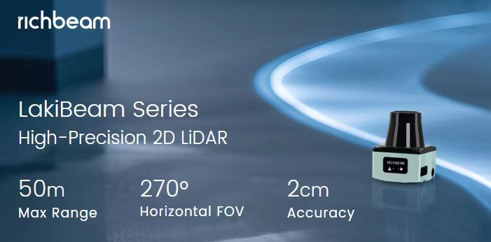

# LakiBeam-Python

## Overview
LakiBeam-Python is an open-source SDK for the **LakiBeam** LiDAR sensor developed by **RichBeam**. It provides a low-level interface for receiving and processing LiDAR data over UDP. The SDK includes a C implementation with a thread-safe double-buffering mechanism, as well as a Python wrapper for seamless integration.

### RichBeam LakiBeam LiDAR

  
For more details, please visit the [RichBeam official website](https://www.richbeam.com/product/LakiBeam).
## Features
- **Efficient UDP Data Reception**: Captures LiDAR packets using a dedicated listener thread.
- **Double Buffering**: Ensures real-time processing of LiDAR frames.
- **Python Wrapper**: Allows easy integration with Python-based applications.
- **Multi-Threaded Processing**: Uses pthreads to handle data reception and processing in parallel.
- **Configurable Callback Mechanism**: Supports user-defined callback functions for real-time data handling.

## Repository Structure
```
LakiBeam-Python/
├── Makefile        # Build script for compiling the shared library
├── rb_lidar.h      # C header file defining the LiDAR API and structures
├── rb_lidar.c      # C source file implementing UDP listener and data processing
├── rblidar.py      # Python wrapper for the C SDK
```

## Dependencies
- **C Compiler**: GCC (for building the shared library)
- **POSIX Threads**: Used for multi-threaded data handling
- **Python 3** (for the Python wrapper)

## Hardware Requirements
- LakiBeam 1
- Ethernet cable
- PC or any microcontroller with an Ethernet port (e.g., Raspberry Pi)

## Compilation & Installation

### 1. Clean the Build
```sh
make clean
```

### 2. Compile the Shared Library
Run the following command to build `rb_lidar.so`:
```sh
make
```
This will generate `rb_lidar.so`, which is required for both C and Python usage.

### 3. Run

First, set your device's Ethernet IP address to `192.168.198.1`.
Then run:
```sh
python rblidar.py
```


## Usage
### C API
#### Initialize LiDAR
```c
#include "rb_lidar.h"

void my_callback(const char* data, int length) {
    // Handle incoming LiDAR data
}

int main() {
    RBLidar* lidar = rblidar_create("192.168.198.1", 2368, my_callback);
    // Run indefinitely or handle signal interruptions
    return 0;
}
```

#### Free Resources
```c
rblidar_destroy(lidar);
```

### Python API
#### Install Python Dependencies
```sh
pip install numpy
```

#### Run LiDAR Data Capture
```python
from rblidar import RBLidar

def my_frame_callback(points):
    print(points)  # Process LiDAR points

lidar = RBLidar("192.168.198.1", 2368, frame_callback=my_frame_callback)
```

## Data Format
Each LiDAR frame consists of multiple **sub-packets** containing:
- `azimuth`: Angle of the LiDAR scan
- `dist`: Distance of the detected point
- `rssi`: Intensity (signal strength) of the point
- `timestamp`: Time when the point was captured

## Contributing
Contributions are welcome! Feel free to submit pull requests or report issues.

## License
This project is licensed under the MIT License.